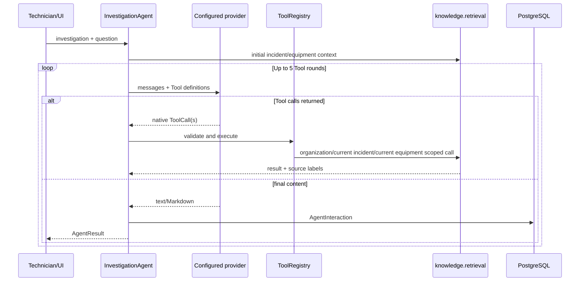
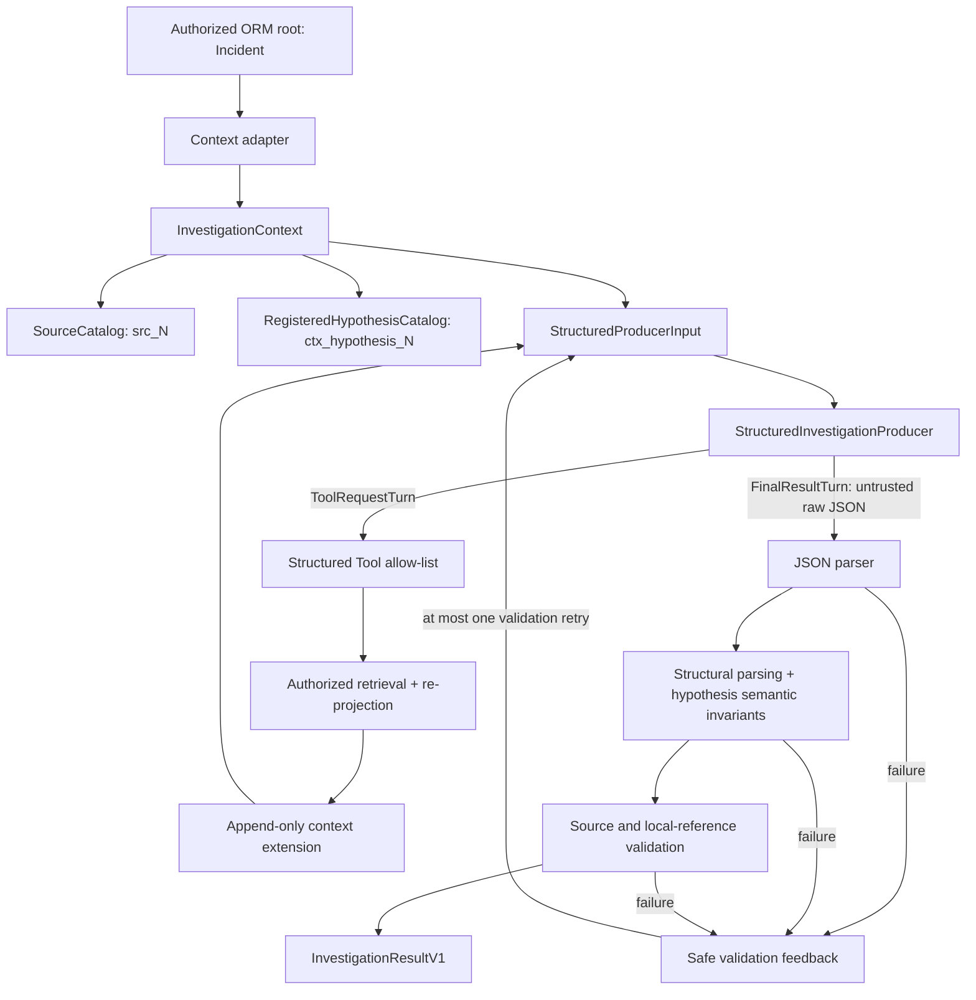

# FaultTrace — Agent Architecture

## Two separate systems

FaultTrace currently has two Agent paths. They share domain/retrieval concepts, but they are not interchangeable.

1. **Legacy Agent / current UI path** — `InvestigationAgent`, provider adapters in `agent/providers.py`, textual Markdown response, and persisted `AgentInteraction`.
2. **Experimental structured path** — authorized context, opaque catalogs, `StructuredInvestigationProducer`, bounded orchestration, and a locally validated `InvestigationResultV1`. It is not wired to views, templates, models, or `AgentInteraction`.

Do not describe the experimental path as production, and do not replace the legacy path until persistence, rendering, compatibility, and model-quality work has been explicitly designed and reviewed.

## A. Legacy Agent



### Core types

- `ToolDefinition`: name, description, JSON-like input schema.
- `ToolCall`: name, arguments, optional provider-native ID/index/protocol data.
- `LLMMessage`: normalized system/user/assistant/tool message.
- `LLMResponse`: provider/model, text, and zero or more Tool calls.
- `LLMProvider`: provider-neutral `generate` interface.
- `ToolContext`: fixed organization, incident ID, and equipment ID for one run.
- `ToolExecution`: safe success/error result and extracted source labels.
- `ToolRegistry`: allow-list, argument validator, and executor dispatch.
- `AgentResult`: textual content, provider/model, Tool trace, source labels, status.
- `AgentInteraction`: persistent legacy record containing question, final response, provider, model, Tool trace, source labels, investigation, user, and timestamp.

### Providers

`agent/providers.py` adapts Mistral, Groq, OpenAI, Gemini, and Anthropic SDKs to the legacy contracts. `agent/factory.py` selects the active organization configuration and decrypts its key. Provider-specific message/Tool mapping remains inside these adapters.

### Legacy Tools

The legacy registry exposes five Tools:

| Tool | Arguments | Scope/effect |
|---|---|---|
| `get_equipment_context` | none | Current equipment characteristics and linked document summaries |
| `search_equipment_history` | none | Prior incidents for the current equipment, excluding the current incident |
| `search_similar_incidents` | `query` (non-empty, max 500) | Organization-scoped text search excluding current incident |
| `get_incident_details` | positive `incident_id` | Details of an incident; retrieval verifies it belongs to the organization |
| `search_documentation` | `query` (non-empty, max 500) | Indexed sections linked to the current equipment |

Unknown Tools and extra/missing/invalid arguments return controlled Tool errors. The registry collects human-readable source labels from Tool results. Legacy Tool payloads are sent directly back to the provider as normalized JSON.

### Loop, presentation, and persistence

The legacy `SYSTEM_PROMPT` asks the model to distinguish current facts from history, preserve sources, expose uncertainty, avoid confirmation, and emit named textual sections. `MAX_TOOL_ROUNDS` is 5. A final response is cleaned of a model-generated “Fontes consultadas” section because the application separately displays Tool-derived sources.

The response is persisted as `AgentInteraction` unless no result exists; a Tool-limit result is also persisted by `InvestigationAgent`, although the view does not redirect to the response anchor for that status. The incident UI displays only the latest interaction.

The `safe_markdown` template filter first HTML-escapes all model text and neutralizes Markdown link brackets, then renders lists and tables. This legacy rendering behavior is unrelated to the future semantic renderer.

## B. Experimental structured Agent



### Responsibilities

- `investigation_context_adapter.py`: reads ORM objects from the authorized root incident, checks relationships, and maps only allow-listed fields into candidates. Retrieval expansions are reauthorized and reprojected before entering context.
- `investigation_context.py`: owns immutable authorized sources, `SourceCatalog`, registered hypothesis snapshots/catalog, deterministic initial ordering, and append-only extension.
- `investigation_structured_producer.py`: provider-independent input and turn boundary. `FakeStructuredProducer` makes orchestration deterministic in tests.
- `investigation_structured_tools.py`: only three semantic Tools, strict argument validation, and context expansion.
- `investigation_structured_orchestrator.py`: builds context, coordinates producer/Tools, enforces limits, parses/validates final output, and records minimal validation audit.
- `investigation_contracts.py`: application-owned V1 parser, reference checks, and semantic invariants.
- `investigation_schema.py`: machine-readable structural schema supplied to producers; runtime contract validation remains authoritative.
- `investigation_producer_policy.py`: failure taxonomy, safe feedback, safe-path grammar, and bounded retry policy.
- `investigation_groq_producer.py`: experimental Groq Chat Completions adapter and protocol continuity state.

### Structured Tools

| Tool | Arguments | Expansion |
|---|---|---|
| `search_equipment_history` | none | Authorized historical incident/intervention candidates |
| `search_similar_incidents` | `query` (non-empty, max 500) | Authorized organization incidents matching terms |
| `search_documentation` | `query` (non-empty, max 500) | Authorized document-section candidates linked to current equipment |

There is deliberately no structured Tool that accepts a database ID. The fixed root incident determines organization, equipment, and current incident. Tool results do not become an unreviewed raw Tool payload in the model's knowledge: the adapter converts them to authorized candidates, `extend_investigation_context` assigns opaque refs, and the next producer input contains the complete updated authorized context. A short Tool message only acknowledges that the context was updated.

The structured Tool limit is 5 successful Tool rounds. Only one native Tool call per Groq response is accepted; parallel calls are disabled.

## Source catalog and provenance

The main types are deliberately different:

- `SourceCandidate`: application-owned input before a public ref is assigned; contains the internal locator, `SourceKind`, authorized content, and display label.
- `AuthorizedSource`: execution-local source after assignment of `src_N`; its producer projection exposes only ref, kind, and content.
- `SourceCatalogEntry`: ref/kind/display-label entry used by the contract validator; it contains no model-generated data.
- `SourceCatalog`: resolves only the authorized `src_N` entries for this execution.
- `RegisteredHypothesisCandidate` / `RegisteredHypothesisSnapshot`: read-only projections of hypotheses already registered in the current investigation.
- `RegisteredHypothesisCatalog`: the authorized set of opaque `ctx_hypothesis_N` refs used by `REGISTERED` result hypotheses.

`SourceKind` currently includes `CURRENT_INCIDENT`, `EQUIPMENT`, `INVESTIGATION`, `FACT`, `EVIDENCE`, `HISTORICAL_INCIDENT`, `INTERVENTION`, `DOCUMENT`, and `DOCUMENT_SECTION`.

Every authorized source has:

- an internal locator, such as an application-side model/primary-key locator;
- a `SourceKind`;
- authorized projected content;
- a display label;
- an opaque model-facing ref such as `src_4`.

The producer representation includes only `ref`, `kind`, and authorized content. Internal locator and display label remain application-side. Registered hypotheses receive separate opaque refs (`ctx_hypothesis_N`) and snapshots that refer to `src_N` evidence.

Initial candidates are deterministically sorted before refs are assigned. Expansion preserves every existing entry byte-for-byte, ignores identical repeats, rejects a locator whose content/kind/label changes, sorts only newly admitted candidates, and appends the next numbers:

```text
round 1: src_1, src_2, src_3
Tool:     retrieves and reauthorizes one new source
round 2: src_1, src_2, src_3, src_4
```

This prevents a reference from silently changing meaning during an execution.

## Groq / GPT-OSS integration

The real experimental provider is Groq and the tested/default model is `openai/gpt-oss-120b`. Current adapter defaults are:

- timeout: 20 seconds;
- maximum completion tokens: 5,000;
- provider request budget: 8 per execution;
- transport retries: at most 1 total per execution;
- retry delay cap: 2 seconds;
- temperature: 0;
- SDK retries: disabled (`max_retries=0`).

With Tools, requests use native Tool definitions, `tool_choice="auto"`, and `parallel_tool_calls=false`; native structured output is not combined with Tool use. Without Tools, the adapter requests JSON Object Mode. In both cases, the local parser/validator is authoritative.

### GPT-OSS `reasoning` continuity issue

GPT-OSS returns a separate `reasoning` field in an assistant message that requests a Tool. Groq's Tool loop expects the complete assistant message to be replayed. The first adapter version reconstructed the message without `reasoning`, causing HTTP 400 on the second round. The adapter now keeps non-empty `reasoning` in its in-memory assistant message alongside content and the native Tool call; it also preserves the native Tool call ID in the matching Tool acknowledgement.

Subsequent real executions reached an accepted second request and produced a `FinalResultTurn`. Therefore **post-Tool protocol continuity is proven**. The reasoning text is never copied into durable experimental telemetry.

## Validation and retries

Final provider content is untrusted until it passes the implementation pipeline:

```text
JSON parsing → structural field parsing (including hypothesis cross-field invariants)
             → source/local/registered-reference validation
```

The project discusses structural, reference, and semantic validation as separate integrity concerns, but the current parser evaluates the hypothesis semantic invariants while constructing each hypothesis, before the final reference pass. Failure categories still preserve the distinction.

Failure categories are `SYNTAX_FAILURE`, `STRUCTURAL_CONTRACT_FAILURE`, `REFERENCE_FAILURE`, and `SEMANTIC_INVARIANT_FAILURE`. `safe_validation_feedback` sends only category, a canonical instruction, and a safe structural path when available. At most one validation retry is allowed.

Transport retry is independent: timeout, HTTP 429, and HTTP 5xx are retryable, with at most one transport retry across the execution. Other HTTP 4xx failures are non-retryable. The global provider-request budget still applies. There is no open-ended retry loop.

## Safe observability

Each rejected validation attempt can retain only:

```yaml
round_number: 2
attempt: 1
category: REFERENCE_FAILURE
path: $.checks[0].basis_refs[0]
instruction: Use only references present in the supplied authorized context.
```

The path grammar permits only `$`, field identifiers, and numeric indexes. Unsafe paths are omitted. Invalid raw output, invalid values, prompt, context, messages, model reasoning, source content, Tool arguments, incident data, arbitrary exception messages, stack traces, headers, and API keys are not part of this audit. Raw `FinalResultTurn` content is ephemeral.

## Real experimental findings

- **HTTP 400 after Tool:** caused by dropping GPT-OSS `reasoning`; fixed locally and then disproved as an ongoing protocol failure by real runs reaching `FinalResultTurn`.
- **Semantic rejection:** `SEMANTIC_INVARIANT_FAILURE` at `$.hypotheses[0]`. The applicable hypothesis invariants were reviewed and retained.
- **Reference rejection:** `REFERENCE_FAILURE` at `$.checks[0].basis_refs[0]`.
- **Correction-round rate limits:** HTTP 429 occurred after the invalid final results; the single transport retry also received 429. Limits were not increased.

The exact invalid values are unavailable by design. The canonical instruction is shared by a category, so safe metadata may not identify which of several invariants at the same path failed.

## Current proof boundary

Proven in real R2 executions: native Tool request, authorized retrieval, append-only expansion, prior ref stability, expanded second-round input, preserved `reasoning` and Tool call ID, accepted second call, and `FinalResultTurn` production.

Not yet proven in real R2: a final output that passes into `InvestigationResultV1`, use of the newly retrieved `src_5` in a valid result, or a successful real validation-correction round. These are model/output and quota limitations observed after protocol continuity, not evidence that the round-trip transport is still broken.
