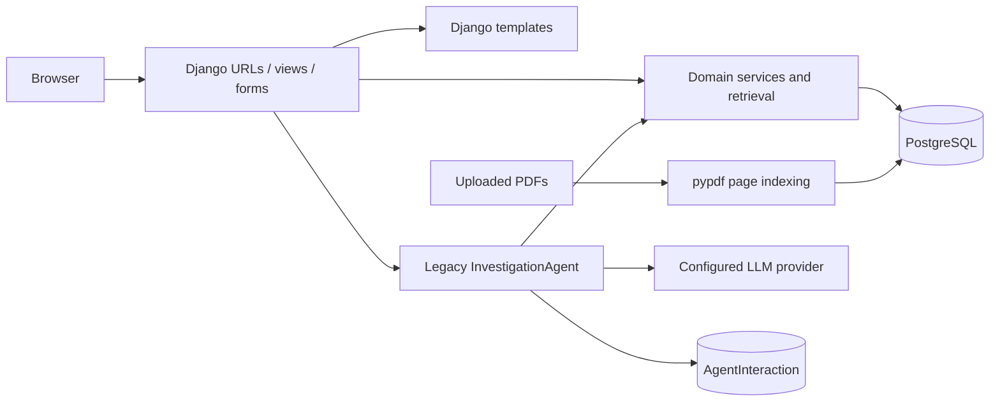
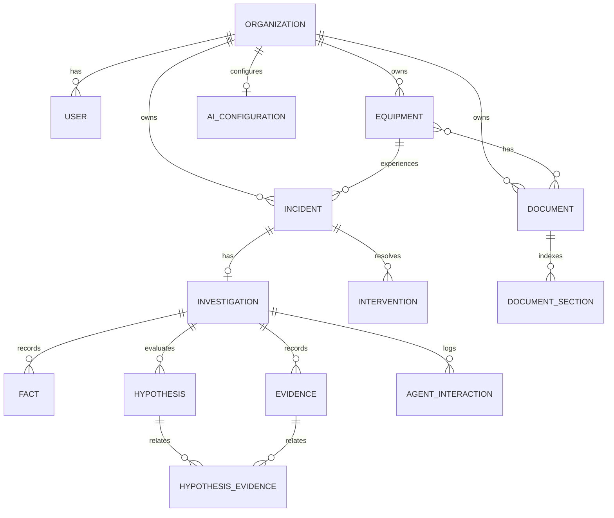

# FaultTrace — System Architecture

## Runtime shape

The project is a server-rendered Django monolith. Views scope records to `request.user.organization`; services enforce lifecycle and cross-organization rules; models add field, relationship, and database constraints. Uploaded media is stored below `MEDIA_ROOT`; Docker Compose mounts a named media volume. There is no separate frontend application.

## Domain model

### Lifecycle

An `Incident` moves only `OPEN → UNDER_INVESTIGATION → RESOLVED → CLOSED`. `start_investigation` uses a transaction and row lock, creates the one-to-one `Investigation`, and advances the incident. `record_resolution` requires an active investigation and non-empty action, confirmed cause, and result; it creates an `Intervention`, finishes the investigation, and marks the incident resolved. There is no service in the current code for the final `RESOLVED → CLOSED` transition.

Facts distinguish technician/system origin. Evidence has exactly one provenance type—document, past incident, or technician—enforced by model validation and a database check constraint. Hypotheses remain operational records managed by the technician; their statuses include `ACTIVE`, `WEAKENED`, `DISCARDED`, and `CONFIRMED_BY_TECHNICIAN`.

## Application boundaries

- `accounts`: every normal user has a required organization and either `ADMIN` or `TECHNICIAN` role. Superusers or organization admins pass `organization_admin_required`.
- `assets`: equipment codes are unique within an organization. Documents can be associated with multiple equipment records in that same organization through form/view scoping.
- `maintenance`: owns incident/investigation/intervention lifecycle and the incident UI. Its `agent_investigate` view invokes only the legacy Agent.
- `knowledge`: owns investigation knowledge records and retrieval. Its views obtain investigations and hypotheses through organization-filtered querysets.
- `config`: one `AIConfiguration` per organization, with encrypted API key and a masked last-four display.
- `agent`: contains two distinct architectures; see [AGENT_ARCHITECTURE.md](AGENT_ARCHITECTURE.md).

## HTTP flow and routes

Root routing exposes Django admin, built-in auth under `/accounts/`, equipment under `/equipments/`, documents under `/documents/`, AI settings under `/settings/ai/`, and incident/knowledge operations under `/incidents/`. `/health/` is a public GET endpoint returning `{"status": "ok"}`. The home page and operational pages require login.

The incident detail page combines domain knowledge, resolution controls, and the latest legacy `AgentInteraction`. It does not call or render `InvestigationResultV1`.

## Retrieval and documents

`knowledge.retrieval` is application-owned and organization-scoped:

- `get_equipment_context` returns equipment data and associated document summaries.
- `search_equipment_history` returns prior incidents for the current equipment.
- `search_similar_incidents` searches organization incidents using normalized terms or current-equipment similarity.
- `get_incident_details` projects investigation facts, evidence, hypotheses, relations, and interventions.
- `search_documentation` searches indexed page text only in documents belonging to the organization and linked to the current equipment.

`index_document` supports PDFs. It extracts and normalizes page text, then atomically replaces sections after successful reading. Unsupported files, no-text PDFs, and extraction failures have explicit statuses. A failed read does not delete previously indexed sections. The caught extraction exception is truncated into the returned `IndexingResult.error`; this is separate from structured-Agent telemetry.

## Multi-tenancy and authorization

`Organization` is the tenant boundary, but there is no framework-level row-level security. Isolation depends on the implemented query filters and validation layers:

1. Views begin from an organization-filtered queryset.
2. Forms restrict selectable related records.
3. Services/models reject cross-organization relationships.
4. Retrieval accepts the organization explicitly.
5. The structured context adapter starts from the root incident, rechecks organization/equipment relationships, and projects only allow-listed fields.
6. Structured Tools accept semantic queries, not arbitrary database IDs.

This is meaningful defense in depth, not a claim of formally verified tenant isolation.

## AI configuration and credential handling

`AIConfiguration` selects one active provider configuration per organization. Supported legacy providers are Mistral, OpenAI, Gemini, Anthropic, and Groq. The API key is encrypted with Fernet using `AI_CREDENTIAL_ENCRYPTION_KEY`; only the last four characters are separately stored for masked display. Changing provider requires a new key. Provider connection testing is an explicit UI action and makes a real external request.

The structured Groq experiment uses the same organization configuration through the Phase 4.1 runner, but is not invoked by normal views.

## Security-relevant layers

| Layer | What it protects | Limit |
|---|---|---|
| Organization-scoped querysets | Cross-tenant UI access | Depends on every entry point using the scoped pattern |
| Model/service validation | Invalid lifecycle and cross-domain relations | Direct database operations can bypass `full_clean`; DB constraints cover only selected invariants |
| SourceCatalog and registered-hypothesis catalog | Model references to unauthorized sources/records | Applies to the structured flow only |
| Opaque `src_N` / `ctx_hypothesis_N` refs | Prevents disclosure/use of arbitrary PKs by the model | Internal locators remain application-side in memory |
| Tool allow-list and argument validation | Unknown Tools and arbitrary arguments/IDs | Tool implementations must preserve authorization |
| Local parser/validator | Untrusted structured model output | Does not establish technical correctness |
| Escaped Markdown rendering | Model-supplied HTML and links in legacy responses | This is presentation protection, not model-output validation |
| Credential encryption | API keys at rest in the database | Key management/rotation and production secret storage are not documented or confirmed |
| Safe structured telemetry | Avoids retaining invalid raw output, reasoning, context, or prompts | Historical snapshots may not contain metadata added later |

## Infrastructure and storage

Docker Compose starts PostgreSQL 17 and the Django development server. The web container applies migrations on startup and waits for PostgreSQL health. Source is copied into the image rather than bind-mounted, so code/template/static changes require a rebuild. PostgreSQL data and uploaded media use named volumes.

The repository contains development/CI configuration, not a confirmed production deployment design. Static serving, backups, TLS, monitoring, worker processes, secret rotation, and production availability are not confirmed.
